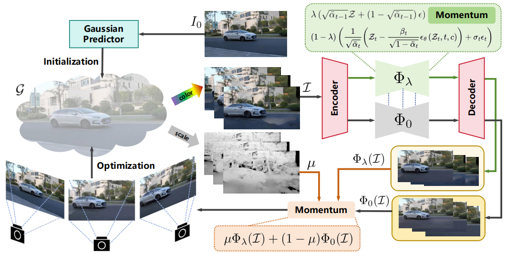

<p align="center">
    <h1 align="center">Scene Splatter: Momentum 3D Scene Generation from Single Image with Video Diffusion Model</h1>
<p align="center">

<p align="center">
    <span class="author-block">
        <a href="https://shengjun-zhang.github.io/">Shengjun Zhang</a></span>,&nbsp;
    <span class="author-block">
        Jinzhao Li</span>,&nbsp;
    <span class="author-block">
        <a href="https://github.com/Barrybarry-Smith">Xin Fei</a></span>,&nbsp;
    <span class="author-block">
        Hao Liu</span>,&nbsp;
    <span class="author-block">
        <a href="https://duanyueqi.github.io/">Yueqi Duan</a></span>&nbsp;
</p>

<h3 align="center"><a href="https://arxiv.org/abs/2504.02764">Paper</a> | <a href="https://shengjun-zhang.github.io/SceneSplatter/">Project Page</a>
</h3>

<p align="center">
    
</p>

## Installation

To get started, create a conda virtual environment using Python 3.10+ and install the requirements:

```bash
conda create -n scenesplatter python=3.10
conda activate scenesplatter
pip install torch==2.1.2 torchvision==0.16.2 torchaudio==2.1.2 --index-url https://download.pytorch.org/whl/cu118
pip install -r requirements.txt
cd gaussianSplatting/submodules/diff-gaussian-rasterization
pip install .
```

## Pre-trained Models

1. Get the pretrained model for [flash3d](https://huggingface.co/einsafutdinov/flash3d) and place it under `flash3d`. We use the v2 version. 
2. Get the pretrained model for [viewcrafter](https://github.com/Drexubery/ViewCrafter) and place it under `viewcrafter/checkpoints`.
3. Get the pretrained model for DUSt3R and place it under `viewcrafter/checkpoints`.
```bash
# downloading DUSt3R
cd viewcrafter
mkdir checkpoints
wget https://download.europe.naverlabs.com/ComputerVision/DUSt3R/DUSt3R_ViTLarge_BaseDecoder_512_dpt.pth -P checkpoints/
```

## Data Preparation

You can prepare you own images and camera trajectories. We provide examples in `assert/images` and `assert/cameras`. For each camera file, it contains a dict with `['intrinsics', 'poses']`. The intrinsics matrix and extrinsic matrix are formed as $4 \times 4$ matrix.
```python
with gzip.open(/path/to/camera, 'rb') as f:
    camera_poses = pickle.load(f)
# camera_poses.keys(): ['intrinsics', 'poses']
# camera_poses['intrinsics']: list of intrinsic matrix
# camera_poses['poses']: list of extrinsic matrix
```


## Running the Code

You can refer to `configs/config.yaml` to change the image path and camera path. You can also change `per_video_length, num_overlap_frames, camera_sample_interval` as needed.
```bash
python scenesplatter.py
```

## BibTeX

```bibtex
@article{zhang2025SceneSplatter,
    title   = {Scene Splatter: Momentum 3D Scene Generation from Single Image with Video Diffusion Model},
    author  = {Zhang, Shengjun and Li, Jinzhao and Fei, Xin and Liu, Hao and Duan, Yueqi},
    journal = {Proceedings of the IEEE/CVF Conference on Computer Vision and Pattern Recognition (CVPR)},
    year    = {2025},
}
```

## Acknowledgements

The project is largely based on [viewcrafter](https://github.com/Drexubery/ViewCrafter), [flash3d](https://github.com/eldar/flash3d) and [3DGS](https://github.com/graphdeco-inria/gaussian-splatting). Many thanks to these projects for their excellent contributions!
